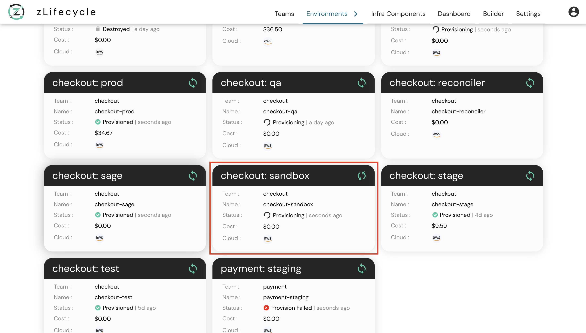
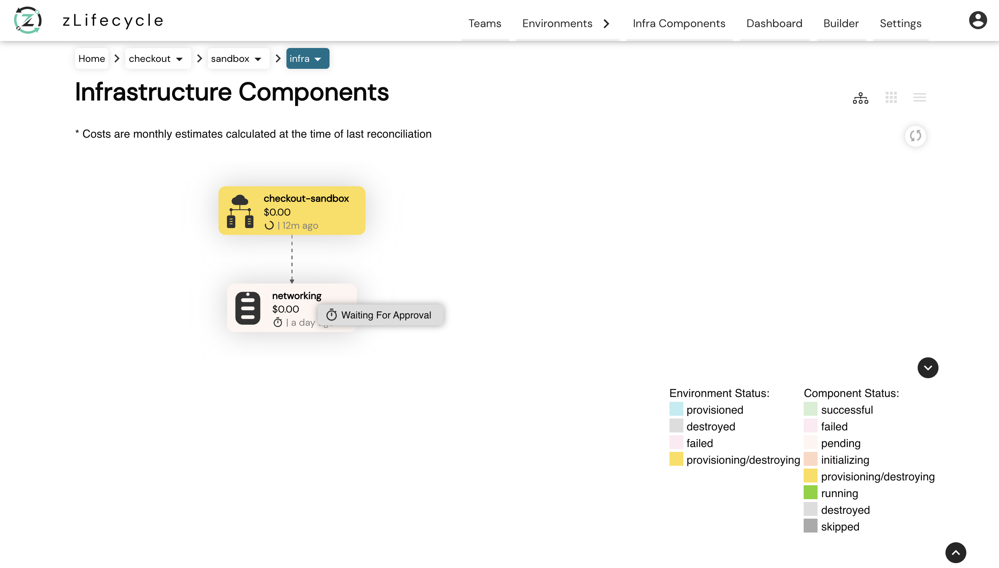
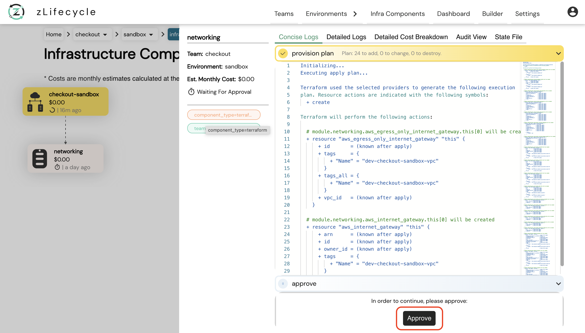
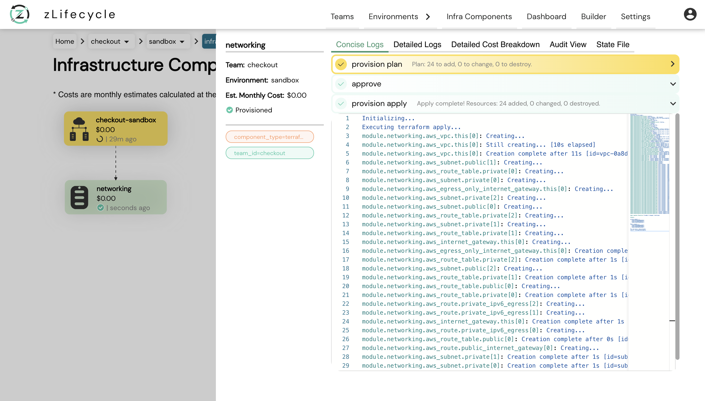

# About Approval

When we are creating an environment YAML file, we have an optional property called **autoApprove** which can be added at **spec** level or **component** level.

Our reconciler while analyzing the YAML, looks for this property which tells it whether to ask for approval at the time of provisioning, tearing, or reconciling the environment.

**NOTE:** 
* Approval prompt will only come if **autoApprove** is `false`
* The default value of **autoApprove** is `false`
* Component level **autoApprove** overrides spec level **autoApprove**

---
**Sample YAML**

```yaml
apiVersion: stable.compuzest.com/v1
kind: Environment
metadata:
  name: dev-checkout-sandbox
  namespace: zlifecycle
spec:
  teamName: checkout
  envName: sandbox  
  autoApprove: false # spec level
  components:
    - name: networking
      autoApprove: true # this will override the one at spec level
      type: terraform
      module:
        source: aws
        name: vpc
      variablesFile:
        source: "git@github.com:githubRepo.git" # Add your repo here
        path: "sandbox/tfvars/networking.tfvars" # Add your tfvars here
      outputs:
        - name: vpc_id
        - name: public_subnets
        - name: private_subnets
        - name: vpc_cidr_block
```
---

### How to Approve?

In this sample example we are **provisioning** an environment called **sandbox**.

Once your YAML is pushed, you will see a similar card on **zlifecycle dashboard**

<br/>



<br/>

* Click the required environment to navigate to the **DAG View**.

<br/>



* As shown in the above image, with **autoApprove** as `false` once our environments plan completes our component now **waits for approval for provisioning**. Once at this page **click** on the component which you want to **approve**.

<br/>



<br/>

* Once clicked, you will see a right panel (which is a **component details view**) as shown in the above image. Now you can click on the **approve button** and then on the **confirm button** to continue with the provisioning of your environment.

Click [here](component-details-view.md) to know more about the **component details view**

<br/>



<br/>

* Once approved, wait for **zlifecycle to provision your environment**. After its completed, you will see a similar view to the above image.