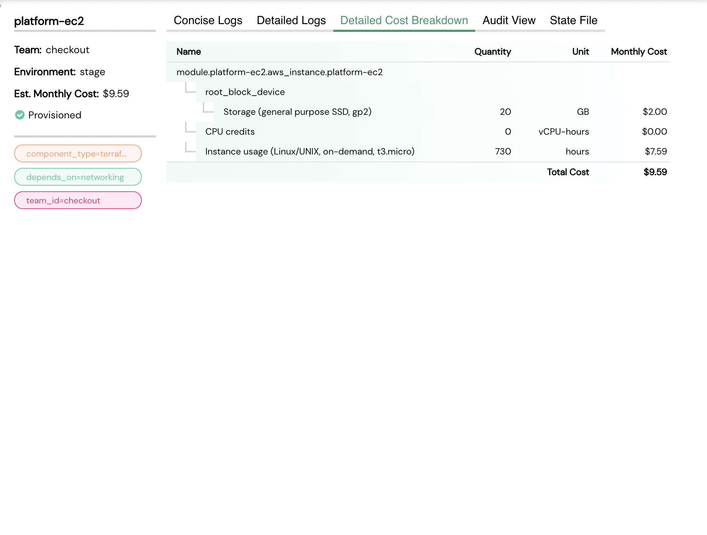

# Cost Calculation

Costs are **monthly estimates** calculated at the time of last reconciliation.

Costs are calculated on the basis of resources that a component uses.

**Example**

zLifecycle uses **infracost** to calculate the component cost so, all the resources that are not supported by this API are not considered while calculating cost.

So, the calculated cost might not be accurate some times.

See the list of supported resources [here](https://www.infracost.io/docs/supported_resources/aws/)