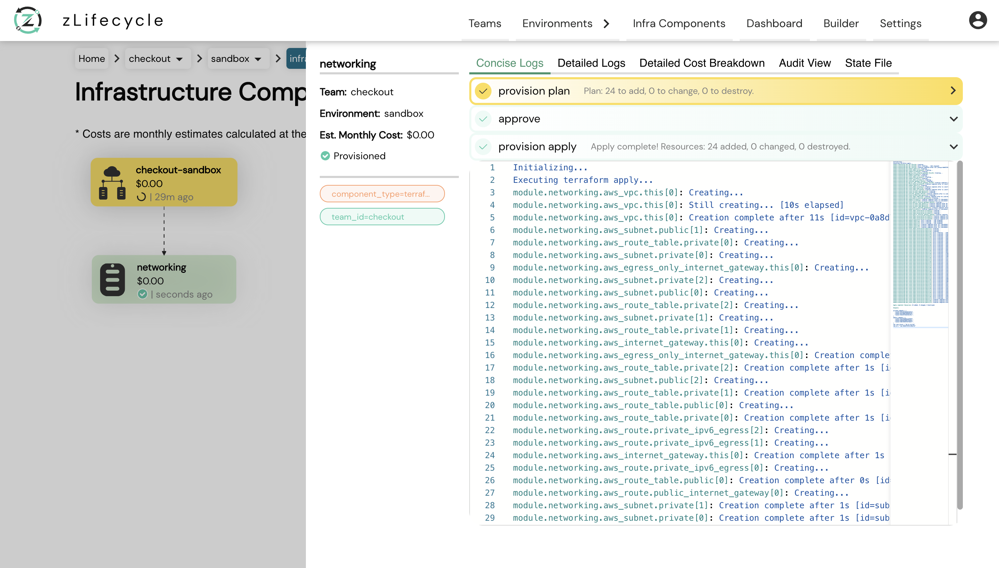
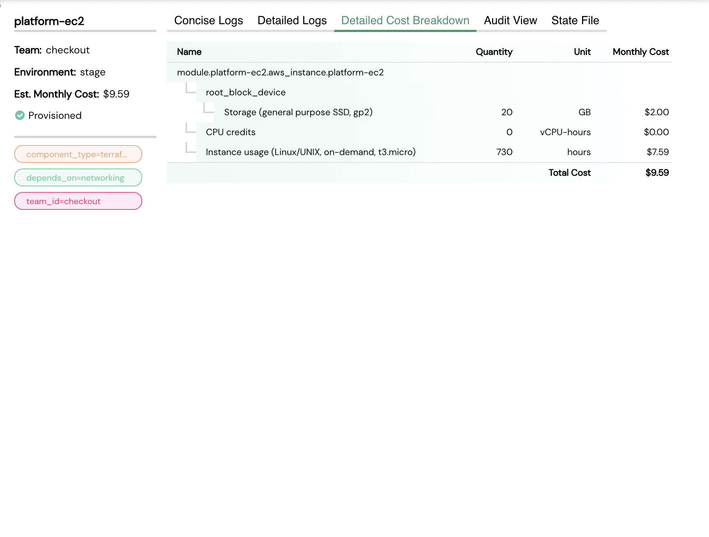
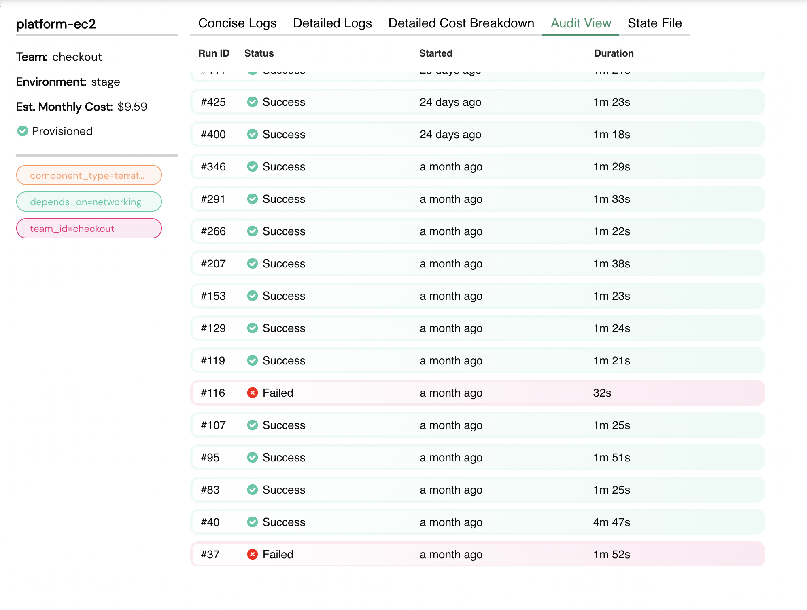
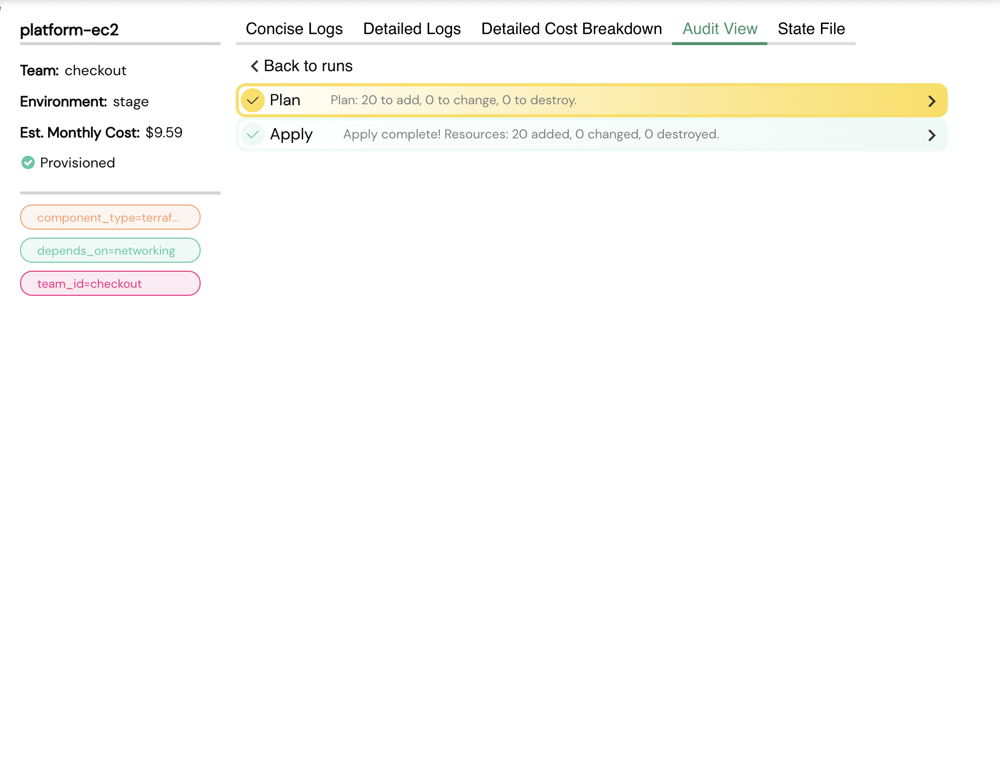
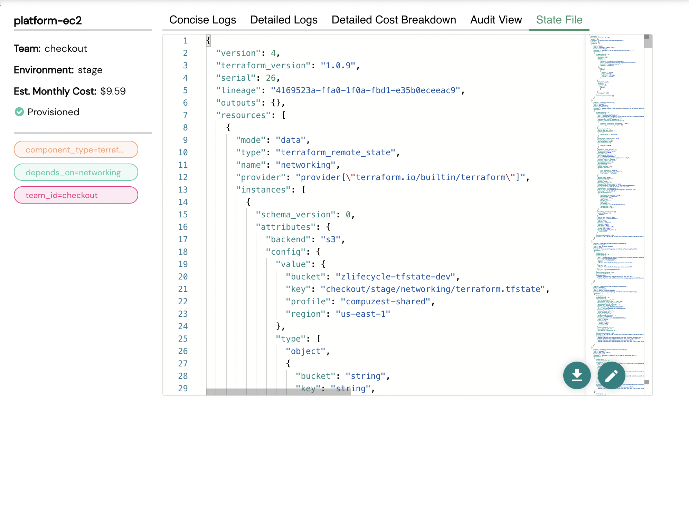
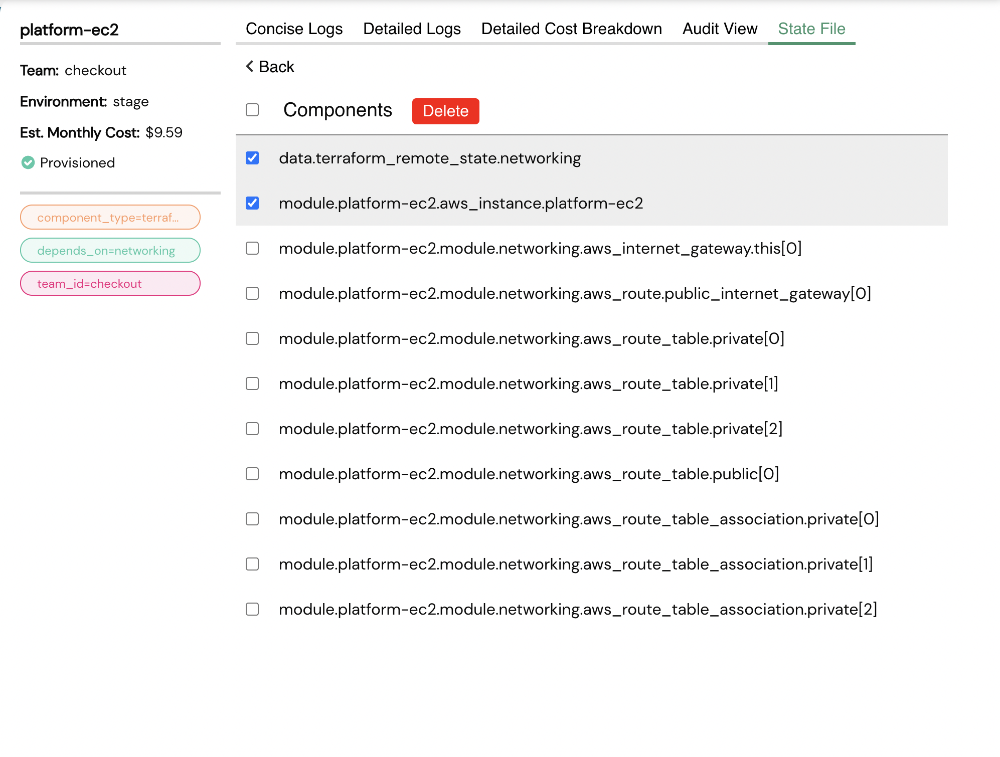

# Component Details View

This view provides the following information about the selected component.

- [Component Details View](#component-details-view)
    - [Logs](#logs)
    - [Detailed Cost Breakdown](#detailed-cost-breakdown)
    - [Audit View](#audit-view)
    - [State File](#state-file)

### Logs

zLifecycle provides the user with two types of logs:

* **Concise Logs:** These logs do not show any unnecessary or verbose information to the end-user.

*  **Detailed Logs:** As the name suggests these logs show every bit of information emitted by zlifecycle's logging mechanism and can sometimes be useful for troubleshooting.

### Detailed Cost Breakdown

This section provides a detailed breakdown of **terraform resources** that contribute to the total component cost.

You can see the cost breakdown of **platform-ec2** in the above image.

### Audit View

This view contains logging information of all the runs(provision, teardown, reconcile) since the first provisioning.

**Audit Run View**

Clicking on any of the audit rows an audit view will open where you can go through the concise logs of that particular run.

Click [here](cost-calculation.md) to understand how cost calculation works.

### State File

This view allows the end-user to view the **state file** of the selected **component** as shown in the above image. Also, we have two buttons in the bottom right corner which allow the end-user to **download** or **edit** the state file.

**Editing the state file**

When you click on the edit button, the state editor view will open and zlifecycle will fetch the **terraform resources**. From here, a user can **delete** the **terraform resources** if required.
