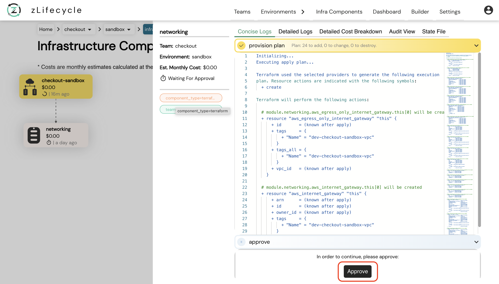

# Hello World Environment

Make sure you've completed [configuring AWS Credentials](../settings/aws_credentials.md) and [onboarded a team](./onboard_team.md) before starting this walkthrough.

## Provision your first Environment

1. Clone the team repo (`zl-[team-name]-config`) you created in [onboarding a team](./onboard_team.md)
1. Create a `hello-world` directory in the cloned repo
  ```bash
  cd zl-[team-name]-config
  mkdir hello-world
  cd hello-world
  ```
1. Run the below bash script using terminal and enter `Company`, `Team` and `Environment` Names when asked.
  ```bash
  bash <(curl -s https://docs.zlifecycle.com/scripts/getting_started.sh)
  ```
1. It will create the following `hello-world.yaml`:
  <details>
    <summary>Click to expand!</summary>
  ```yaml
  apiVersion: stable.compuzest.com/v1
  kind: Environment
  metadata:
    name: company-hello-world
    namespace: company-config
  spec:
    teamName: your-team
    envName: hello-world
    components:
      - name: images
        type: terraform
        module:
          source: aws
          name: s3-bucket
        variables:
          - name: bucket
            value: "company-hello-world-images-abcde"
      - name: videos
        type: terraform
        dependsOn: [images]
        module:
          source: aws
          name: s3-bucket
        variables:
          - name: bucket
            value: "company-hello-world-videos-vwxyz"
  ```
  </details>
1. Commit the changes and push to Github
1. Go to Environments page on **zLifecycle** UI
    * After a few minutes you should see your new environment
    * It will provision the `images` s3 bucket first, then `videos` s3 bucket
1. Once it starts provisioning, click on the `images` component
1. You should see the **provision plan** in the right panel
1. Once the plan finishes you need to approve the changes by clicking `Approve` below the terraform plan (as shown in the image below)
1. This will start provisoning the `images` s3 bucket (which is terraform apply)



## Teardown your first Environment

After you have provisioned your first environment, let's go through the teardown exercise.

You can read more about `teardown` [here](../policies/teardown.md).

1. Add `teardown: true` in `hello-world.yaml` at the `spec` level. See example below:
  <details>
    <summary>Click to expand!</summary>
  ```yaml
  apiVersion: stable.compuzest.com/v1
  kind: Environment
  metadata:
    name: zmart-hello-world
    namespace: zmart-config
  spec:
    teamName: your-team
    envName: hello-world
    teardown: true # Add this
    components:
      - name: images
        type: terraform
        module:
          source: aws
          name: s3-bucket
        variables:
          - name: bucket
            value: "zmart-hello-world-images-abcde"
      - name: videos
        type: terraform
        dependsOn: [images]
        module:
          source: aws
          name: s3-bucket
        variables:
          - name: bucket
            value: "zmart-hello-world-videos-vwxyz"
  ```
  </details>
1. Commit and push changes to Github
    * The teardown will start at the bottom most leaf node
1. Approve the teardown plan when prompted
1. Monitor the progress on **zLifecycle** UI
