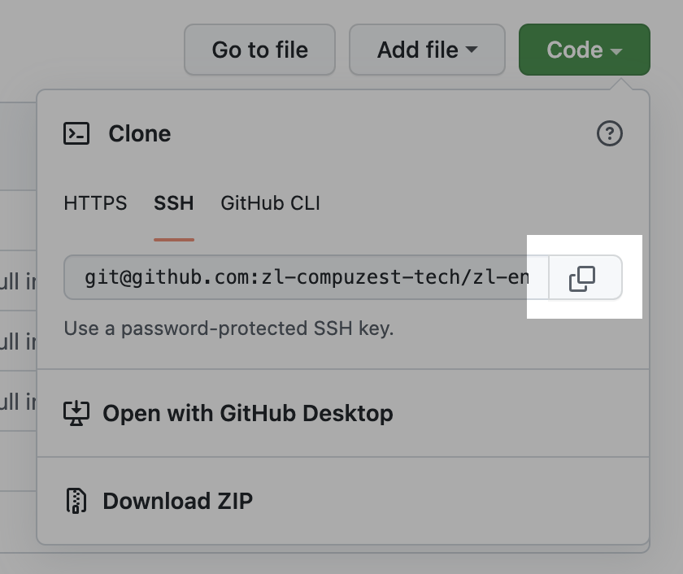

# Onboard a New Team

This doc decribes how to add a team in **zLifecycle**.

> NOTE: If you've done this before you can skip to [Define a Team](#define-a-team)

At the end of this doc you should have 2 new Github repos:

1. `zl-teams` which will hold your team definitions
1. `zl-[team-name]-config` which will hold the infrastructure config for a single team

Let's get started!

## Install zLifecycle Github App

1. [Register](https://www.zlifecycle.com/register) for an account on **zLifecycle**
1. [Create](https://github.com/new) a Github repo to store your team definitions
  > NOTE: Use `zl-teams` as your repo name
1. [Go here](/settings/zlifecycle_app_installation/) to give the **zLifecycle** Github app access to your newly created repo

## Define a Team

1. [Create](https://github.com/new) a Github repo to store team specific infrastructure
  > NOTE: Use `zl-[team name]-config` as your repo name
1. Copy the SSH url to this repo
    
1. **In your `zl-teams` repo** create a `teams` directory
1. In the `teams` directory create the following yaml file:
    ```yaml
    apiVersion: stable.compuzest.com/v1
    kind: Team
    metadata:
      name: teamname
      namespace: companyname-config
    spec:
      teamName: teamname
      configRepo:
        # Paste the URL from step 2
        source: git@github.com:org/repo.git 
        path: "."
    ```
1. Once you commit and push the change it will register the team repo with **zLifecycle** and watch for any updates
1. The `zl-teams` repo should resemble:
    ```
    repo
    |   README.md
    |___teams
    |   |   team-name.yaml
    ```
