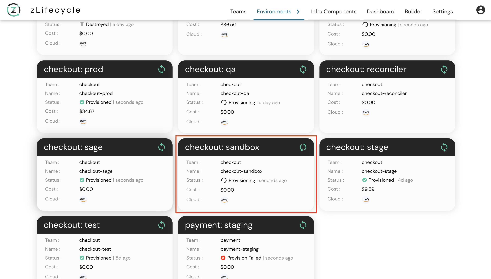

# How to Approve 

If the `autoApprove` flag is set to `false` or is omitted (defaults to `false`) the plan will need to be manually approved before it can proceed with applying. Details on how and where to set these flags are [here](approval.md).

In this sample example we are **provisioning** an environment called **sandbox**.

Once your YAML is pushed, you will see a similar card on **zlifecycle Environments** page.

 

 

Click the required environment to navigate to the **DAG View**.

 

As shown in the above image, with **autoApprove** as `false` once our environments plan completes our component now **waits for approval for provisioning**. Once at this page **click** on the component which you want to **approve**.

 

 

Once clicked, you will see a right panel (which is a **component details view**) as shown in the above image. Now you can click on the **approve button** and then on the **confirm button** to continue with the provisioning of your environment.

Click [here](../component_details_view.md) to know more about the **component details view**

Once approved, wait for **zlifecycle to provision your environment**. After its completed, you will see a similar view to the image below:

 

 
