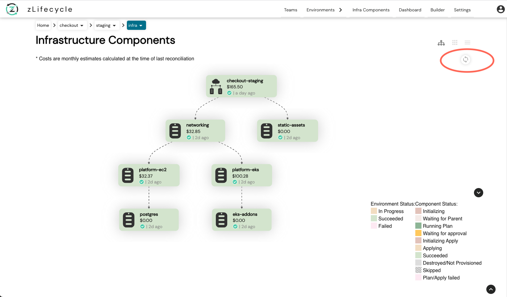

# Manual Reconcile

You can manually reconcile an environment by clicking on the `Reconcile Environment` button. This will apply the latest plan and re-provision the environment starting from the parent components.

