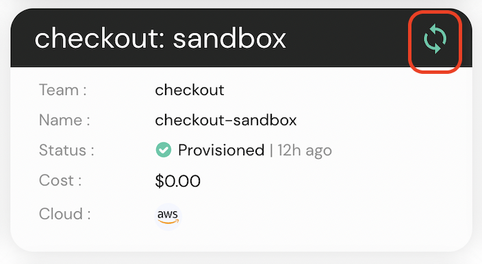

# Manual Reconciliation

Environment reconciliation can happen in two ways. A gitops push will trigger an environment to reconcile and re-provision based on the latest plan, but you can also manually trigger a reconcile which will re run the last plan.

You can reconcile and synchronize your environment, either from the **environment card** or from the **DAG view**.

You will also get a notification in the bottom right corner once reconciliation started.

### Environment Card

From the Environments page -

There is a green sync icon on the environment card, click that icon to **reconcile** the environment.

### DAG View

From the Environment DAG view.

There is a sync button, at the top right region of the page, click that icon to **reconcile** the environment.

# Status

* **Green:** Synced
* **Grey:** Not In Sync
* **Red:** Error
* **Rotating:** Sync In Progress
