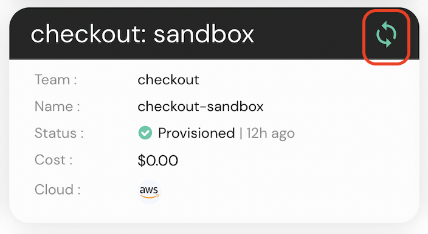
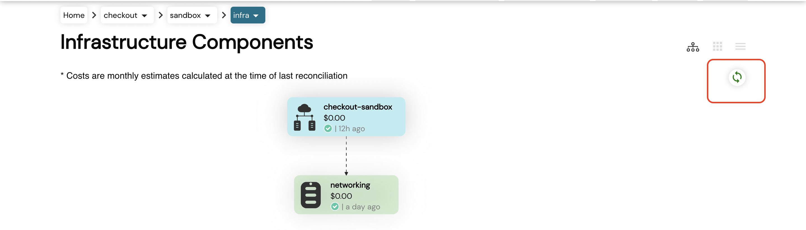

# Reconciling

You can reconcile and synchronize your environment, either from the **environment card** or from the **DAG view**.

You will also get a notification in the bottom right corner once reconciliation started.

### Environment Card

Go to dashboard or environments view.

In the above screenshot you can see a green sync icon, just **click** that icon to **reconcile** the environment.

### DAG View

Go to DAG view.

In the above screenshot you can see a green sync button, click that icon to **reconcile** the environment.

# Status

* **Green:** Synced
* **Grey:** Not In Sync
* **Red:** Error
* **Rotating:** Sync In Progress

