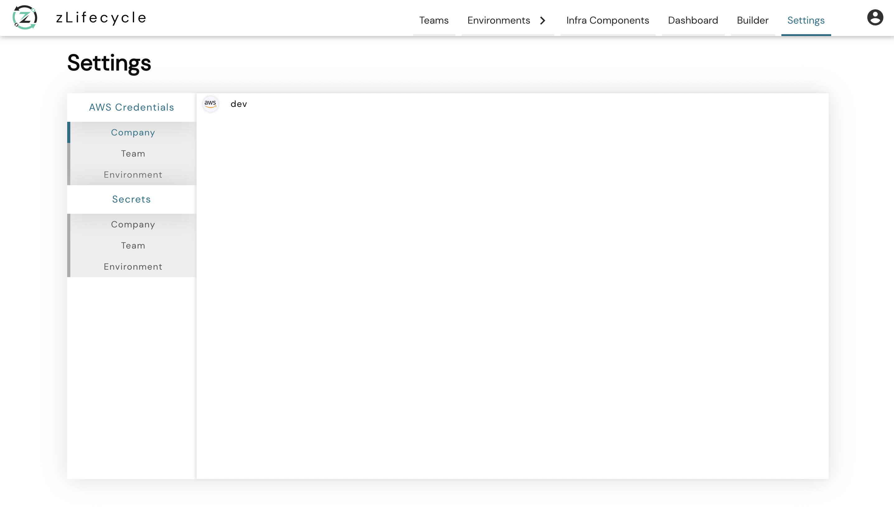
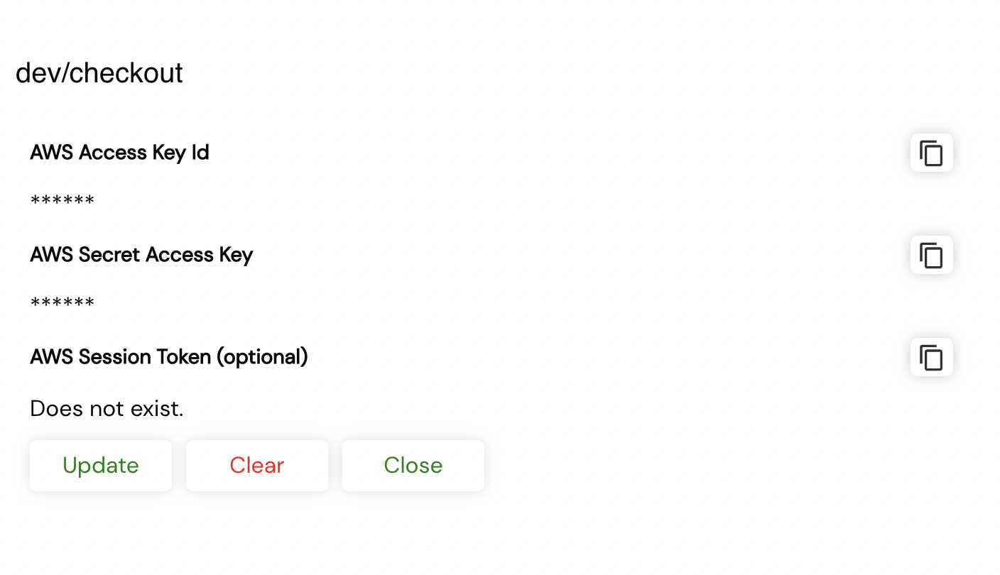

# AWS Credentials

AWS credentials are used by **zLifecycle** to provision your environment on AWS. You can provision an environment on AWS only after setting these credentials.

These credentials can be **created** & **updated** using **zLifecycle** secrets manager, which is accessible by clicking on the **Settings** Navigation button, as highlighted in the below image.

AWS secrets that need to be set:

* `Access Key Id`
* `Secret Access Key`
* `Session Token` [Optional]

There are 3 scopes to which these secrets can be added, `company`, `team`, `environment`. By default, **zLifecycle** tries to find secrets at environment level, then at team level and lastly at company level.
