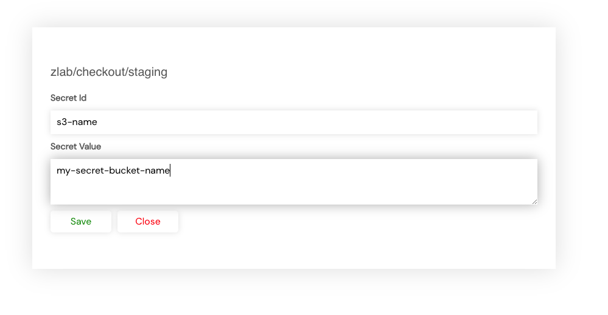

# Environment Secrets

If you want to pass a secret to a component (for example a terraform module) you can create a secret using settings page and then reference it in the environment YAML. 

Similar to AWS secrets, there are 3 scopes to which these secrets can be added, `company`, `team`, `environment`. By default, **{{ company_name }}** tries to find secrets at environment level, then at team level and lastly at company level.

To add a secret, go to the appropriate scope and click on the Add button.



Once added these secrets can be used in the secrets property of the environment YAML as below.

**Example**

```yaml
secrets:
  - name: bucket      # Terraform variable name
    key: s3-name      # Secret Id
    scope: company    # Should be one of: company, team, environment
```
