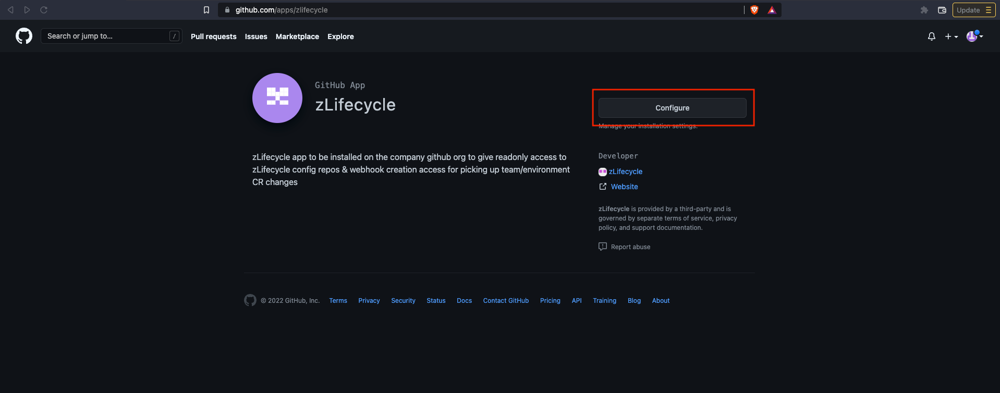
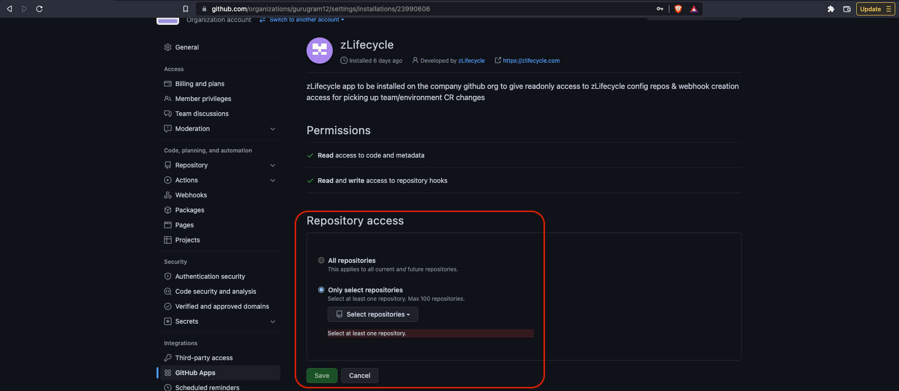

# zLifecycle Github App Set up

Setting up the zLifecycle Github App is required for adding a new Team repository.

Sign In to you GitHub account on your browser.
---
1. Navigate to [https://github.com/apps/zlifecycle](https://github.com/apps/zlifecycle) and click on Configure button.

---
2. You will be navigated to the below page, where you need to configure your organization.

---
3. On the next page you need to select your repositories and then click on Save. 
