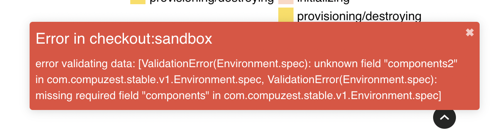

# Errors

Almost all errors are logged in the **concise logs** section of the [component details view](component-details-view.md). You can backtrack and get to the root cause of the error that happened during reconciliation.

Usually the errors that might occur are related to:-

- **AWS Secrets**: When secrets are not set and one is trying to provision an environment. See [secrets section](secrets.md) to set secrets. 
  
- **Terraform configuration**: This usually occurs if terraform initialization fails. When this happens contact your administrator. 
  
- **Incorrect YAML**:
   - Formatting problem
   - Wrong properties
For all yaml issues a **notification** is shown on the UI, telling you the **problem part** in that yaml.

**Example**

```yaml
apiVersion: stable.compuzest.com/v1
kind: Environment
metadata:
  name: dev-checkout-sandbox
  namespace: zlifecycle
spec:
  teamName: checkout
  envName: sandbox  
  autoApprove: true
  components2: # Error Part
    - name: networking
      type: terraform
      module:
        source: aws
        name: vpc
      variablesFile:
        source: "git@github.com:zl-dev-tech/checkout-team-config.git"
        path: "sandbox/tfvars/networking.tfvars"
      outputs:
        - name: vpc_id
        - name: public_subnets
        - name: private_subnets
        - name: vpc_cidr_block
```



In the above screenshot we can see that an unknown field **component2** is used in the **environment.spec** section of the yaml, which we can see in the **example**.