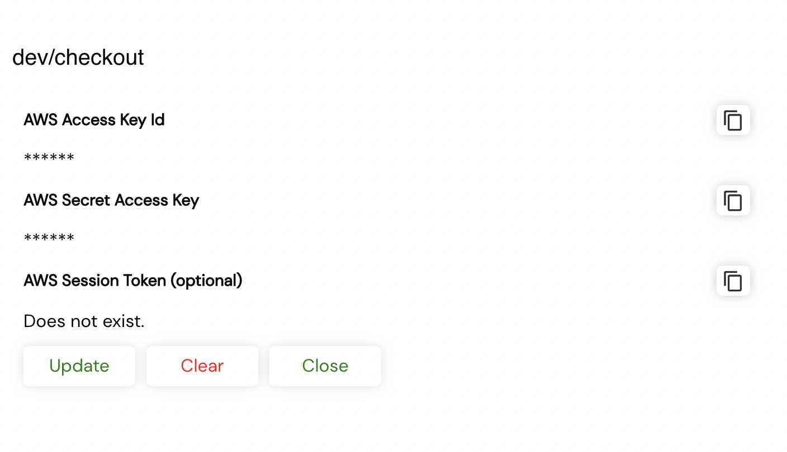
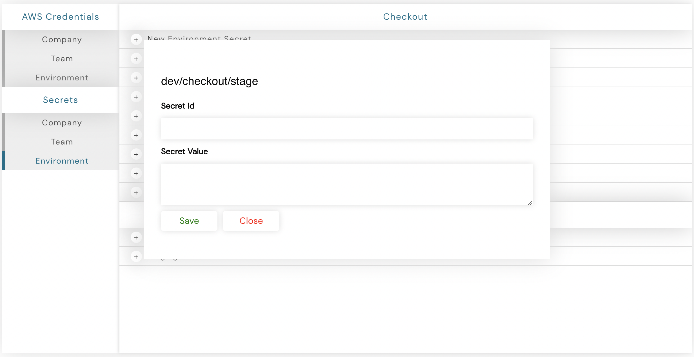

# Secrets

An end-user can **create** and **update** their **secrets** using our secrets manager, which is accessible by **clicking** on the **Settings Navigation button**, as highlighted in the above image.

zLifecycle has two types of secrets:
* **AWS:** As the name suggests, helps you to create secrets for your AWS account.
   
* **Custom:** Custom secrets required during the reconciling of the environment.

### AWS Secrets

AWS section has three type of secrets:

* `Access Key Id`
* `Secret Access Key`
* `Session Token` [Optional]

These secrets are used by zlifecycle to provision your **AWS** environment. To add to that, we also have 3 scopes to which these secrets can be added, `company`, `team`, `environment`.

**NOTE:** You need to **add AWS Secrets before** provisioning an environment **for the first time**.

By default, zlifecycle tries to find secrets at environment level, then at team level and lastly at company level.

### Custom Secrets

These are the secrets that a user can use at his own behest.

Similar to AWS secrets we have 3 scopes here as well `company`, `team`, `environment`.

To add a secret, select the scope and click on the Add button.

Here you can **provide** the **secret name, value** and you are set.