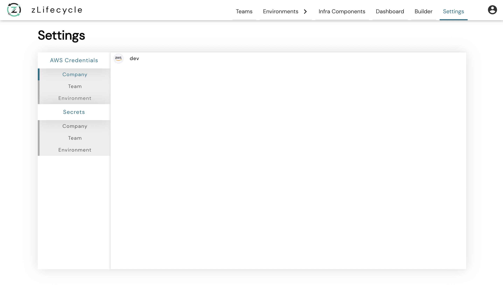

# Secrets

An end-user can **create** and **update** their **secrets** using our secrets manager, which is accessible by **clicking** on the **Settings Navigation button**, as highlighted in the above image.

zLifecycle has two types of secrets:
* **AWS:** As the name suggests, helps you to create secrets for your AWS account.
   
* **Custom:** Custom secrets required during the reconciling of the environment.

### AWS Secrets
